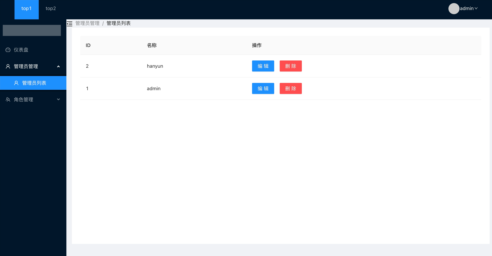
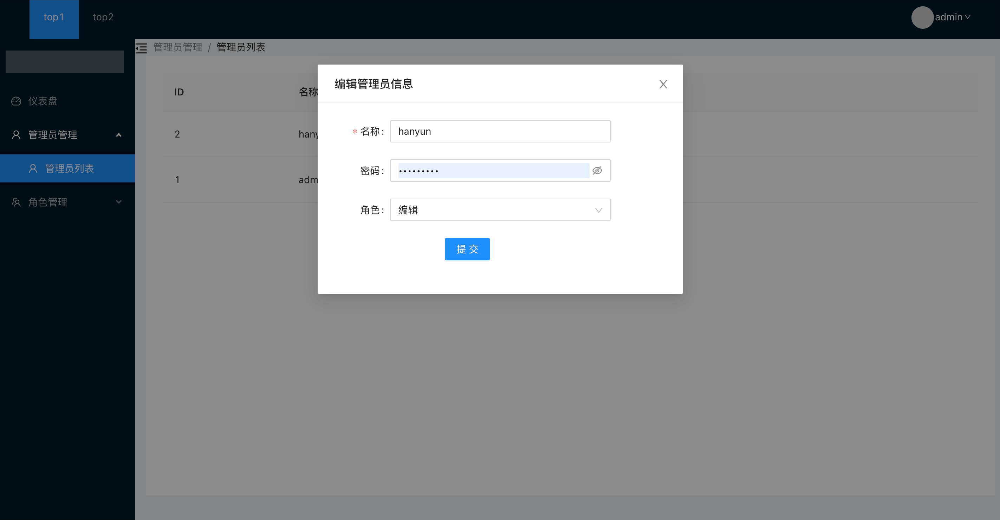
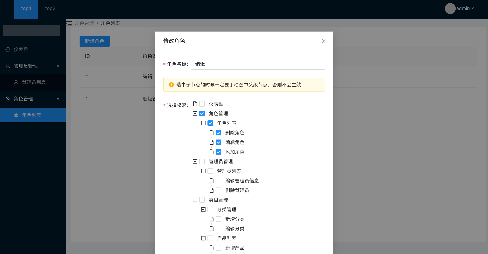
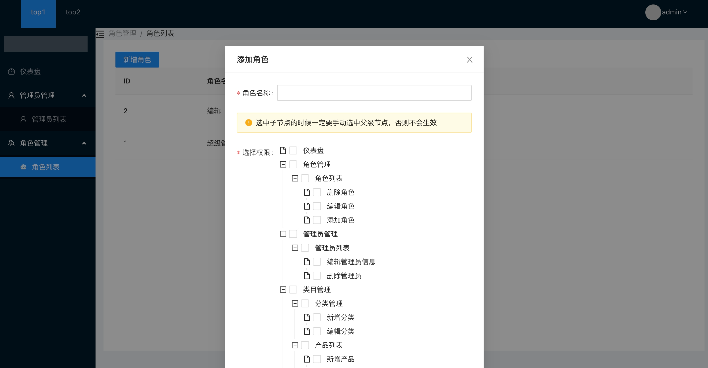
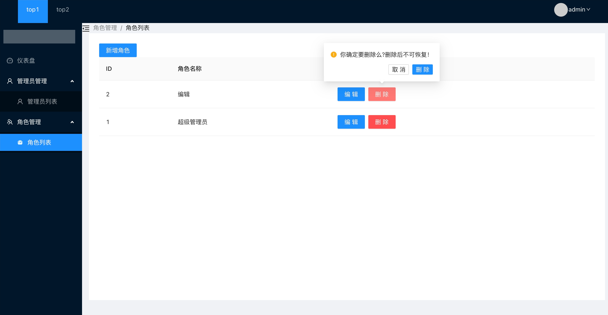

## 用TS的姿势实现一个react后台管理系统

前言：

2020年6月份来到武汉就职于一家小公司，公司原来的系统采用原来的mvc模式。前端用的layui框架，后台用的laravel框架。刚进入公司没多久，
公司决定重写用户后台和管理后台。前台那哥们采用vue技术栈，我还是用laravel。刚开始写就一脚踩在了坑里。由于采用前后端分离的方式开发，
我写接口用postman做接口测试，用法md写接口文档，我们忽略了一点，浏览器为了网络的安全，默认是禁止js跨域请求；我们的认证方式采用了jwt，
结果再次掉在坑里，header里面加的参数接收不到；前端那哥们，由于刚入前端的坑不到两三年，做事情的时候总是纠结于代码，很少关注业务逻辑。
而前后端分离的开发方式将很大一份的业务逻辑转移到前端处理，再加上他第一次用vue，语法都不熟练，造成矛盾激化，打了不少嘴炮。总之一句话，一言难尽。

啰嗦了这么多，是时候展示真正的技术了。下面给大家介绍一下本小册的主要内容。

1.  介绍ts入门基础知识。这部分的知识，虽然很基础，但是很重要。后面我们用到的redux和react-dom-router也是采用ts的语法进行编程，学好这部分才可以更加游刃有余的处理后面的问题
2.  抽离react组件。react的哲学是组合，像堆积木一样拼接业务逻辑。我会带领大家，抽离公共模块，精简业务逻辑，提升自身的工作效率
3.  掌握RBAC权限管理。公司的后台管理系统会有各种限制，比如：同样的一个页面，有的人进来可以看到按钮，有的人进来看不到按钮；有的人能看到某些数据，有些人又看不到，
这个时候我们怎么处理呢？这个时候你就需要详细的设置RBAC权限了。我会带领大家快速了解RBAC，最后抽离组件来管理权限。

展示一下最终效果

1. TS姿势入门
    1.  基本数据类型
    3.  接口
    4.  类
2.  用TS的姿势了解react
    1.  初始化react项目
    2.  使用接口声明props属性
    3.  使用接口声明state状态
    4.  jsx模板语法
    6.  组件
    5.  生命周期
3.  用TS的姿势打开redux的大门
    1.  redux介绍
        1.  redux的使用场景
        2.  redux的基本原则

    2.  redux的核心概念
        1. state
        2. action
        3. reducer
        4. store
    3.  redux-thunk为redux和react牵线搭桥    
        1.  connect链接props与state
        2.  mapStateToProps将state转化为propos
        3.  mapDispatchToProps发射props给react
    
4.  react-router-dom入门
    1.  BrowserRouter
    2.  Redirect路由跳转
    3.  Route定义路由
    4.  Switch路由切换
    5.  matchPath判断路由是否匹配
    6.  NavLink定义路由链接
    7.  withRouter高阶组件
    
5.  RABC权限管理
    1.  RBAC介绍
    2.  RBAC实现原理
    3.  权限如何划分
    4.  前后端分类RBAC实现思路

6.  核心实现
    1.  整体布局实现
    2.  定义权限路由表
        1.  公共权限
        2.  私有权限
    3.  redux管理权限
        1.  store存储权限
        2.  redux-thunk为react与权限牵线搭桥   
    4.  react-router-dom渲染权限
        1.  NavLink展示左侧菜单
        2.  Route与Switch渲染权限
        3.  matchPath判断权限
    5.  自定义组件
        1.  公共布局渲染内容
        2.  左侧菜单
        3.  页面内权限管理
    
7.  拓展
    如何结合公司业务进一步拓展，例如：公司规定，订单列表，
    销售只能看到与自己相关的订单，售后只能看到部分订单参数