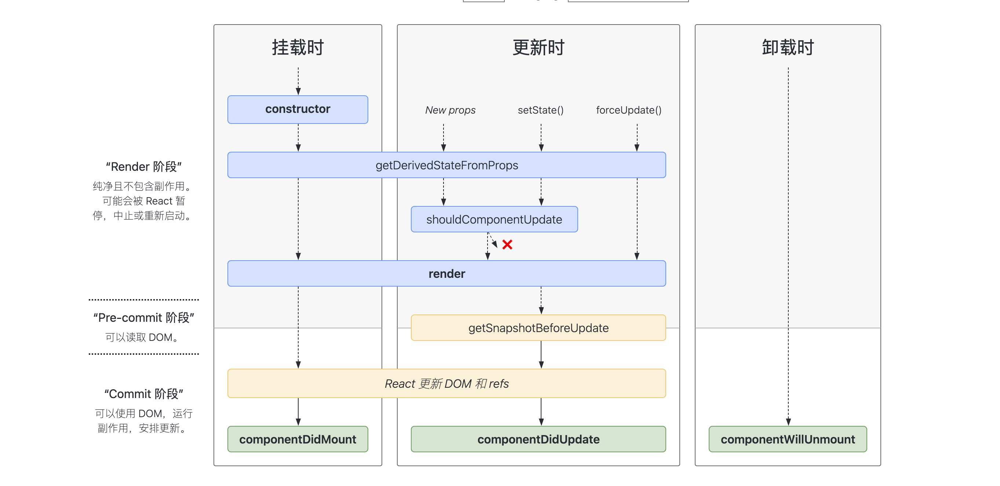

# 组件的生命周期
> 官网的文档讲解的很详细，我这里只是简单的罗列一下，具体可以参考结尾给的链接 

### 挂载

当组件实例被创建并插入 DOM 中时，其生命周期调用顺序如下：

1. constructor()

   如果不初始化 state 或不进行方法绑定，则不需要为 React 组件实现构造函数。

2. static getDerivedStateFromProps()
   
   getDerivedStateFromProps 会在调用 render 方法之前调用，并且在初始挂载及后续更新时都会被调用。它应返回一个对象来更新 state，如果返回 null 则不更新任何内容。
   
3. render()

   render() 方法是 class 组件中唯一必须实现的方法。

4. componentDidMount()

   componentDidMount() 会在组件挂载后（插入 DOM 树中）立即调用

#### 更新

1. static getDerivedStateFromProps()
2. shouldComponentUpdate()
3. render()
4. getSnapshotBeforeUpdate()
5. componentDidUpdate()

### 卸载

componentWillUnmount()

当组件从 DOM 中移除时会调用

## 参考文档

[生命周期速查表](https://projects.wojtekmaj.pl/react-lifecycle-methods-diagram/)

[参考文档](https://react.docschina.org/docs/react-component.html)

